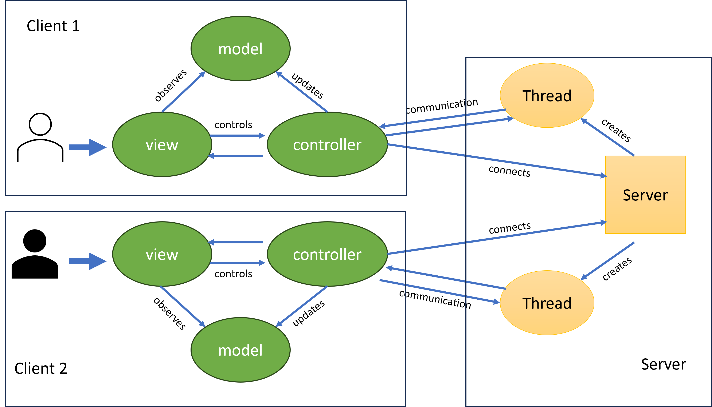
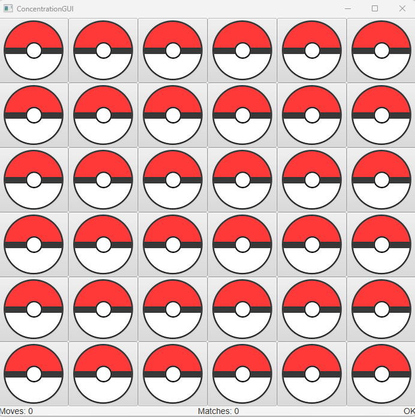
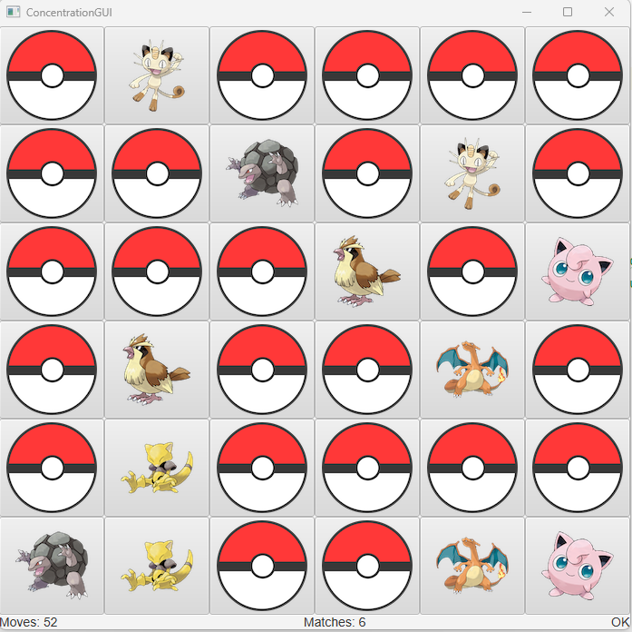

# Pokémon Pairing Game	
### Abouts
* Developed a web-based full-stack Pokémon image pairing game using client-server design pattern where the server manages the puzzles, and the client solves the puzzle via web communication.
*	Utilized multi-thread design so that the web server serves multiple clients concurrently.
* Implemented a Graphical User Interface (GUI) using the JavaFX library and the model-view-control (MVC) frontend architecture so that players can play with mouse clicks.
### Design Diagram

### Demos
#### game loading

#### playing

